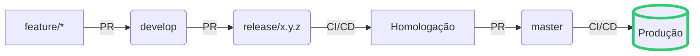

# Padrão de Commits e Estrutura de Branches para o Prafrentex

```markdown
# Padrões do Projeto Prafrentex

## 📌 Estrutura de Branches (Git Flow Adaptado)

```
master (produção)
↑    ↖
|      hotfix/...
|     /
develop (integração contínua)
↑
release/x.y.z (homologação)
↑
feature/... | bugfix/... (desenvolvimento)
```

### 🔀 Fluxo Principal

1. **Branches de Desenvolvimento**:
   - `feature/nome-da-feature` (novas funcionalidades)
   - `bugfix/nome-do-bug` (correções)

2. **Branches Principais**:
   - `develop` (branch de integração)
   - `release/x.y.z` (preparação para produção)
   - `master` (código em produção)

### ⚙️ Como Criar Branches

```bash
# Feature/Bugfix (sempre a partir da develop)
git checkout develop
git pull origin develop
git checkout -b feature/nova-funcionalidade

# Release (a partir da develop)
git checkout develop
git checkout -b release/1.0.0

# Hotfix (a partir da master)
git checkout master
git checkout -b hotfix/correcao-urgente
```

## ✍️ Padrão de Commits (Conventional Commits Adaptado)

### Estrutura Básica
```
<tipo>[escopo(opcional)]: <descrição breve>

[corpo detalhado (opcional)]

[rodapé com referências (opcional)]
```

### Tipos de Commit

| Tipo       | Backend (Yii2/PHP)       | Frontend (Angular/Bootstrap)  |
|------------|--------------------------|------------------------------|
| `feat`     | Nova funcionalidade      | Nova funcionalidade          |
| `fix`      | Correção de bug          | Correção de bug              |
| `refactor` | Refatoração de código    | Refatoração de componentes   |
| `db`       | Mudanças no banco        | -                            |
| `api`      | Alterações em endpoints  | Consumo de API               |
| `ui`       | -                        | Alterações visuais           |
| `ux`       | -                        | Melhorias de experiência     |
| `config`   | Configurações Yii2       | Configurações Angular        |
| `chore`    | Tarefas de manutenção    | Tarefas de manutenção        |
| `docs`     | Documentação             | Documentação                 |

### Exemplos

**Backend**:
```bash
feat(api): adiciona endpoint POST /api/projetos
- Implementa validação dos dados de entrada
- Adiciona testes unitários
Ref: PROJ-123
```

**Frontend**:
```bash
fix(ui): corrige alinhamento do grid de projetos
- Ajusta margens no mobile
- Corrige overflow em telas pequenas
```

**Banco de Dados**:
```bash
db: adiciona tabela de auditoria
- Migration: m231015_142300_create_audit_table
- Adiciona relations no model Projeto
```

## 🔄 Workflow Completo

1. Criar branch a partir da `develop`
2. Desenvolver com commits semânticos
3. Abrir PR para `develop`
4. Após aprovação, criar `release/x.y.z` a partir da `develop`
5. Testar em homologação
6. Aprovar PR para `master`
7. Criar tag versão:
   ```bash
   git tag -a v1.0.0 -m "Release inicial"
   git push origin v1.0.0
   ```

## ⚠️ Regras Importantes

- Nunca commitar diretamente na `develop` ou `master`
- Sempre atualizar a branch local antes de criar novas branches
- Usar rebase (não merge) para atualizar feature branches
- Referenciar issues/tasks nos commits (ex: `Ref: PROJ-456`)


## ✅ Fluxo Consolidado Prafrentex

```
[FEATURE] → [DEVELOP] → [RELEASE] → [MASTER]
```

### Passo-a-passo detalhado:

1. **`feature/` ou `bugfix/`**
   - Criada a partir da `develop`
   ```bash
   git checkout develop && git pull && git checkout -b feature/nova-funcionalidade
   ```

2. **PR para `develop`**
   - Revisão de código obrigatória
   - Merge após aprovação

3. **Preparação de Release**
   - Criar `release/x.y.z` a partir da `develop`
   ```bash
   git checkout develop && git checkout -b release/1.5.0
   ```

4. **PR da `release` para homologação**
   - Testes manuais/automáticos
   - Validação de QA
   - Ajustes diretos na branch de release (se necessário)

5. **CI/CD (Release)**
   - Disparo automático ao abrir PR
   - Deploy em ambiente de staging/homologação

6. **PR para `master`**
   - Merge apenas após:
     ✓ Todos os testes aprovados
     ✓ Validação de PO/Responsável
     ✓ Versionamento atualizado

7. **Deploy em Produção**
   - Disparado pelo merge em `master`
   - Tag automática da versão:
   ```bash
   git tag -a v1.5.0 -m "Release 1.5.0" && git push origin v1.5.0
   ```

### Fluxo Visual Atualizado



### Pontos Críticos de Atenção:

1. **Sincronização Pós-Release**
   ```bash
   git checkout develop && git merge release/1.5.0
   ```
   - Garantir que a `develop` receba as correções feitas na release

2. **Hotfixes** (fluxo paralelo):
   ```mermaid
   graph LR
       H[hotfix/*] -->|PR| M(master)
       M -->|Merge back| D(develop)
   ```

3. **Versionamento**
   - Usar SEMVER (MAJOR.MINOR.PATCH)
   - Atualizar em:
     - `composer.json` (backend)
     - `package.json` (frontend)
     - CHANGELOG.md

Este fluxo garante que:
- Todo código passa por pelo menos 2 etapas de validação (PR + Release)
- A master sempre reflete o que está em produção
- O histórico fica auditável e organizado

Quer ajustar algum ponto específico para a realidade do Prafrentex?
